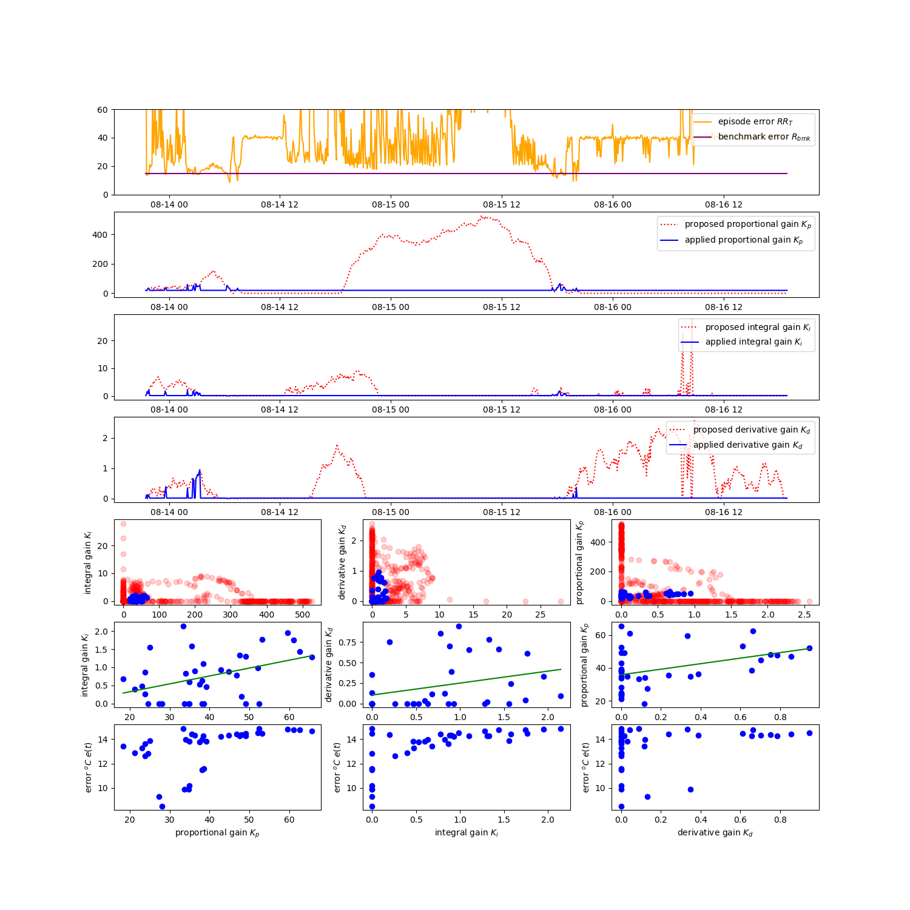
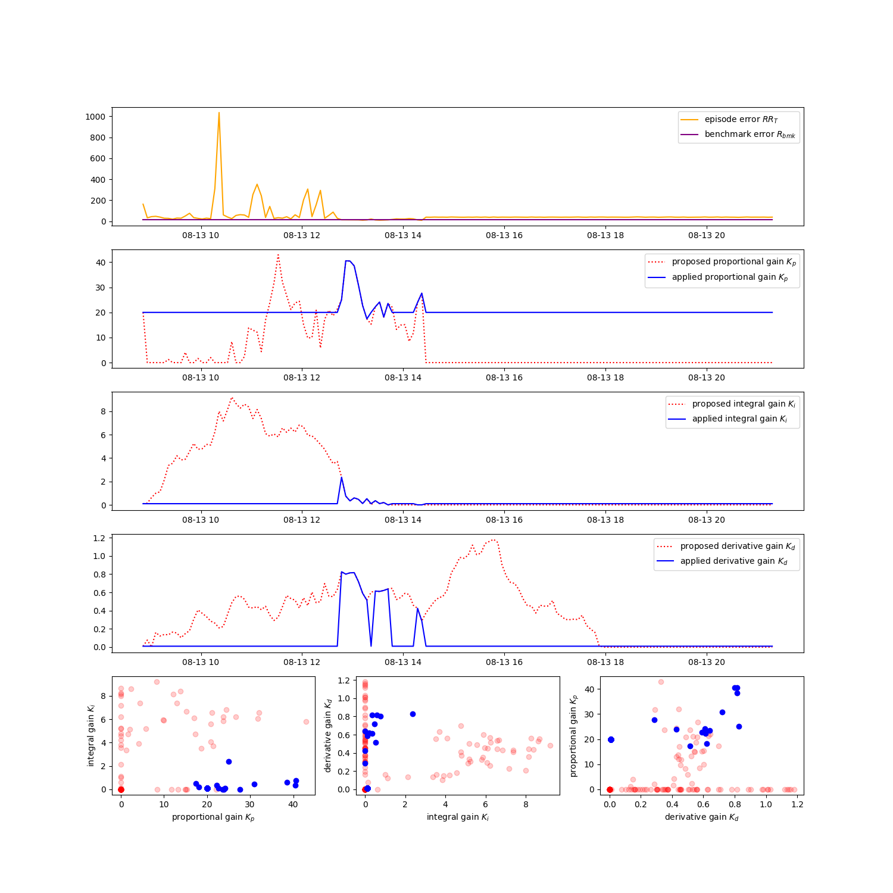
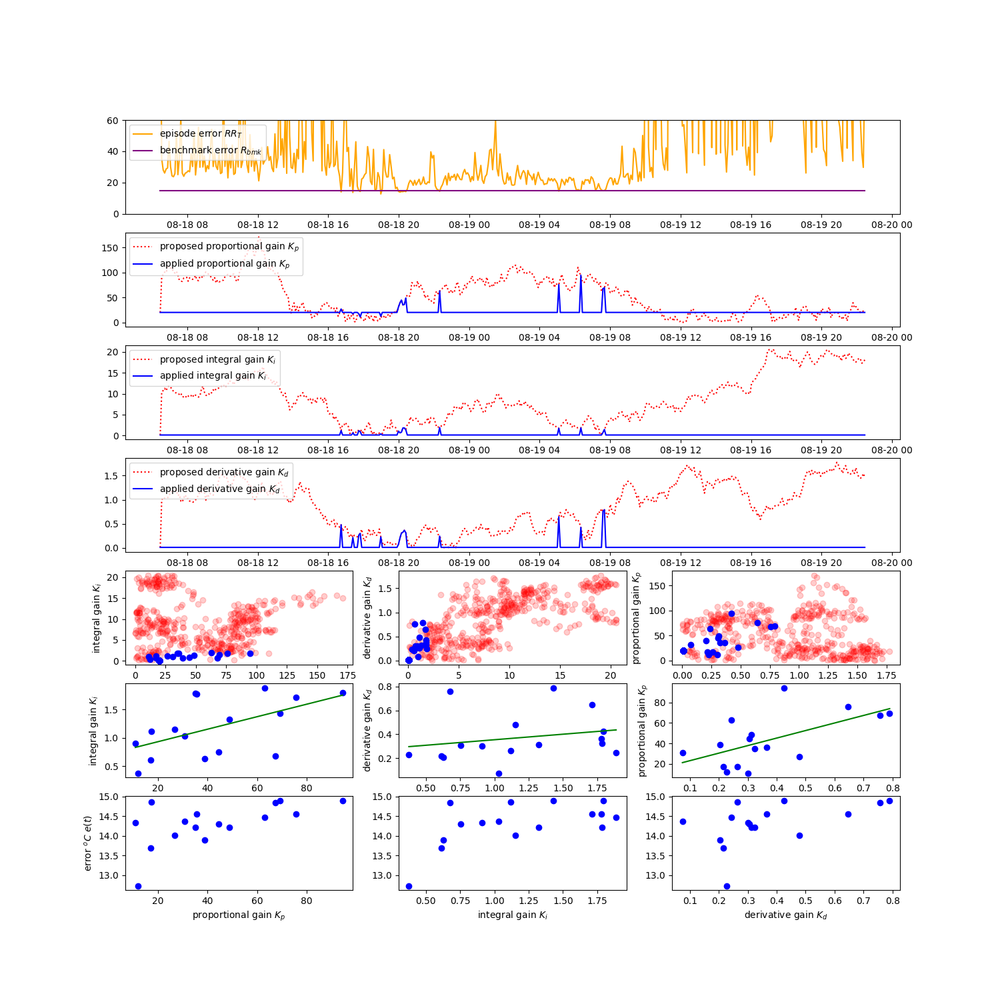

# Iterations of the Project

This page documents some of the findings and iterations that this project has gone through. If you find it interesting to know how the project developed over time, this page is for you.

The topics are organised in chronological order, in a sort of logbook format.

---
## 2023-08-12: Tanh versus Relu

The agent was producing negative values for the PID gain values. As PID controllers expect all parameters to be of the same sign (either all positive or all negative), that was a problem. As a stop-gap measure I mapped all negative values to 0. I believe that led to the many, many 0 values that the agent ended up setting. Consider the learning graph below:

     

In that graph, we see that the agent predominantly chose 0 values for gains, sometimes even 0 for all three gains. I did not test for this explicitly, but intuitively I would say that this will happen when half the action space is mapped onto 0.

Based on these observations, I chose to switch from Tanh activation to ReLu activation. The advantage of ReLu is that it only produces positive values.

At first, I thought it would be enough to just switch the activation function to ReLu, but that turned out to be wrong. The policies were being initialised with `-f1`, `-f2` and `-f3` to negative values too. After fixing that, I still got negative action values.

     

I traced that to the noise generator. While the noise is _added_ to the signal, negative noise on small signal values may still cause the sum to be negative. After taking the absolute value of the noise this problem was solved too and I only got positive values.

So to switch the agent to ReLu activation you need all three of setting the final activation to ReLu, initialise the agent only with positive values and only generate positive noise values. After this switch, the agent no longer tried to bring all values down to 0. This last set of graphs shows the agent happily meandering through the search space. this shown best by the small, red-and-blue scatter plots that show the three gains each plotted against another.

     

---
## 2023-08-20: Priming the Memory

With the agent happily plodding through the action and observation space, I found that the agent would wander very far away from what is likely to be a useful area to explore. I deliberately  set the bounds for each gain quite wide, so that I would be able to see how well the agent would zoom in on where the optimal policies might lie. If you look at the last graph of the Tanh/ReLu entry, you will see that there are only a few blue spikes where the agent found useful values for the PID gains. However, it then goes off to explore further out, instead of exploring around the acceptable values.

We are not training some generic agent and we should use knowledge about the problem domain to improve our system any way we can. We are trying to optimize a PID controller that has been hand-tuned to be reasonably stable already. My intuition tells me that stable values for the PID gains should be clustered in the vicinity of the hand-tuned values.

To validate the intiution, we will run for a while wth completely random actions. That should reveal how the clustering of the useful action space looks like. To do that, we have `random-but-stable-pid-autotuner.py`. This implements an agent that makes no attempt to learn or optimise. All it does is generate random values for the PID gains, so that we can see if there is clustering in the action space or not.

