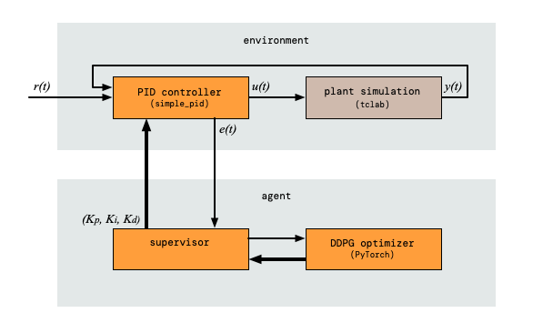
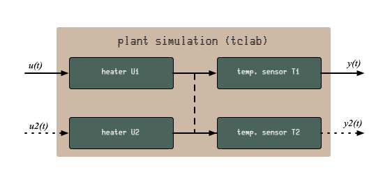
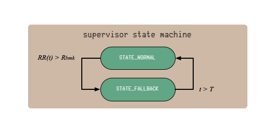

# Stability Preserving PID Autotuner
Industrial and marine systems use
[Proportional Integral Derivative controllers (PID)](https://en.wikipedia.org/wiki/PID_controller)
for a lot of things. They are simple to use and very effective. PID controller
tuning is an area that still leaves room for improvement. In many cases, PIDs
are quickly hand-tuned and then left to operate under what is likely a
suboptimal set of parameters. This makes tuning of PID controllers ripe for
automation.

As a system ages, its behaviour may change over time. Materials wear and
components may be swapped out for equivalent, but not identical, replacements.
In an ideal world, all PID controllers on systems would be periodically retuned
to compensate for changes in response of systems. If not periodically, then at
least they should be retuned whenever components are replaced. In practice this
rarely happens. Even the initial tuning is often done quickly and
conservatively. A PID controller with a fixed set of parameters is not equipped
to adapt to this.

Specifically in an environment where energy conservation is important, well
tuned PID controllers can help eek out the last few drops of performance.

This project explores a safe, stability-preserving, Reinforcement Learning (RL)
based automatic PID controller tuning mechanism. The work of this project is
heavily based on
[Stability-preserving automatic tuning of PID control with reinforcement learning](https://arxiv.org/abs/2112.15187)
by Ayub I. Lakhani, Myisha A. Chowdhury and Qiugang Lu, which is released under
[CC BY 4.0](https://creativecommons.org/licenses/by/4.0/).  It is also
[available on Youtube](https://www.youtube.com/watch?v=ymodIJ7yMKo). This work
will be referred to as "the paper" througout this project.

There are benefits to using reinforcement learning not to learn the control of a
system, but rather learn how to tune a PID controller to find the optimal PID
control for a system. PID controllers are well understood and mathematically
easy to explain. For systems in environments where human lives are dependent on
the good operation of systems, the verifiability of the operation of that system
is very important. Pure RL control would make the control system into a black
box. RL systems are not considered to be in the category of explainable machine
learning models. By limiting the scope of RL to PID tuning, the tuning process
may be a black box, while the resultant control system is still well understood
and explainable.

In an emergency when the reinforcement learning were to break down, humans can
still go in, take control and hand-tune the PID controller. This gives engineers
the option to maintain automatic control under partial systems failure.

Finally, reinforcement learning does not tire or get bored. It follows subtle
changes in systems response.

**Future work:**

* Use the changes in PID control to detect tiny changes in systems behaviour, possibly as early warning system for maintenance.
* http://brettbeauregard.com/blog/2011/04/improving-the-beginner%E2%80%99s-pid-tuning-changes/
* Explore how we might have two separate PID controllers: one that responds to setpoint changes and one that is good at tracking stable setpoint values.
* Make the processes queue based internally.
* Consider starting a fresh episode whenever the setpoint changes (significantly). That way, we have a predictable error form to work with in each episode, at the expense of having to disregard episodes that we cur short.

**Limitations:**
* systems with relatively few learning episodes (winches?) or where it is hard to measure the feedback.
* The paper assumes that setpoint is fixed, so this is for systems where the only disturbances are system wear and outside influences.

**TODO**:

groundwork

* background task to generate graphs (but watch the clock, we cannot have the system sleeping).
* set up an episode-generating server somewhere
* add sleep/wall-clock time check.

training

* import phil's agent code
* document phil's code
* bolt the disk episodes onto the memory class
* add diagrams
* attributions etc

applying

* make a optimizer-supervisor class

More:

* buy a tclab or two (awaiting delivery)
* _after delivery_: Explore sample rate limits with the hardware version: https://tclab.readthedocs.io/en/latest/notebooks/02_Accessing_the_Temperature_Control_Laboratory.html#tclab-Sampling-Speed
* check time progression in both tclab and simple_pid. I think I am mixing real-time and sped-up times on these, which will screw up the integral and derivative calculations.
* Add consistent time speedup to the `PlantControl` class.
* decide: do I cut episodes short? That way the step response episodes are of better quality, since they will start at the setpoint change.
* add start values for the PID controller, otherwise we get breaks between episodes
* Do I keep the pattern of comparing running with totals?
* make time compression possible for simulated envronment, read up on how simple_pid does that.
* _after DDPG_ consider convolutions,

---
## Flawed Premise
Of course, the whole premise for this idea is flawed. The reason not to tune PID
controllers is in part lack of knowledge and in part lack of a real need,
finished off by the fact that developers choose predictability over performance.
Making a machine learning based autotuner solves none of these. If anything, the
relative novelty of machine learning for this application will drive developers
away from using it.

So this tuner either works fully automatically and invisibly in the background,
or it will never be used.

So yeah, there is that...

---
## Design
The diagram below shows the design of the whole system. We will use a simulator
to explore the operation of the stability-preserving PID tuner.

Shown are two clusters: the environment and the agent, in the naming convention
of the machine learning community. The environment shows the PID controller
receiving the setpoint $r(t)$ and feeding the control variable $u(t)$ into the
simulated plant. The plant's output is the process variable $y(t)$, which is fed
back into the PID controller.

The agent cluster shows the optimizer and the supervisor that keeps the system
stable. The fat arrows represent the flow of the $K_p$ $K_i$ and $K_d$
parameters. These parameters are generated by the machine learning based
optimizer and then checked and possibly clamped by the supervisor. The paper
proposes to use the squared error of the running controller and comparing that
against a benchmark error. If the benchmark is exceeded, the supervisor kicks in
and changes the PID controller to use its fall-back parameter set.

<p align="center" width="100%">
     
</p>

The simulated components are shown in a sandy colour, while the orange
components would also be deployed to a production environment.

---
## Virtual Environment and Dependencies
The dependencies are listed in `requirements.txt`.

```bash
$ python3 -m venv venv
$ source venv/bin/activate
(venv) $ pip install -r requirements.txt
```

With the virtual environment set up, you are now ready to run the code for this
project. If you don't use virtual environments a lot, don't forget to activate
it when you return to the project.

---
## Basic Plant Control
Before we worry about the complexity of supervision and automatic PID tuning, we
need an environment where we can control a plant. This script brings the control
components together into a working simulation. These just use a fixed set of PID
parameters.

For the simulated plant, we'll use
[Temperature Control Lab (TCLab)](http://www.apmonitor.com/pdc/index.php/Main/ArduinoTemperatureControl)
by [APMonitor](https://apmonitor.com). The advantage of TCLab is that it can be
used in code as simulator as well as being available as Arduino shield for real
world testing. The TCLab has two heating elements, but we only use one of them
for this project.

For the PID controller, we use
[simple_pid](https://simple-pid.readthedocs.io/en/latest/user_guide.html) by
[Martin Lundberg](https://github.com/m-lundberg). This is a neat little PID
controller library for Python. We don't use it's `output_limits` property, but
implement capping $u(t)$ in code, just so we can see the capped versus uncapped
values. This gives a sense of how well the capacity of the plant matches the
desired control range.

Simulations with the plant control class run in episodes of length $T$, as is
being done in the paper. Working with time-limited episodes gives each run a
simple end condition. Later on, it gives us a nice granularity for training
machine learning models.

### TCLab Details
The TCLab has two heating elements and two temperature sensors, as shown in the
diagram below. The diagram also shows the variable names that we use for each
item. For normal simulations, we only use heater $U1$ and sensor $T1$.

<p align="center" width="100%">
     
</p>

Interestingly, the two heating elements do interact, as shown by the dashed line
between the arrows. You can see it when you look at the secondary process
variable in the graphs below. When we switch on (say) heater `U1`, the
temperature for the other heater rises slightly, as measured on `T2`. This is
true for the simulated as well as the physical systems. In fact, experimenting
with this interaction is part of the course materials designed for the TCLab. We
may use this at a later stage to simulate component wear.

### Time and Realtime
Since we plan to run this system on actual hardware, we run the simulations in
real, wall-clock time. This means that simulations run for a long time to get
results. Training 2000 episodes, like in the paper, will take one week of
wall-clock time.

See also:
[Synchronizing with Real Time](https://tclab.readthedocs.io/en/latest/notebooks/03_Synchronizing_with_Real_Time.html)
for the TCLab and for `simple_pid` see
[`__call()__` API reference](https://simple-pid.readthedocs.io/en/latest/reference.html#simple_pid.pid.PID.__call__).

### Running Basic Plant Control
Here is how to run the basic plant control. For now, the setpoint is just a
fixed value of 23 $\celsius$.

The programming is cyclic, just like it would be on a PLC, for example. In fact,
if you own a TCLab device, you can use this loop to control that. Much as I like
matrix processing and its efficiency, the matrix programming model does not fit
the continuous control loop that is common for live systems.

```sh
(venv) $ python plant_control.py
```

The episodes are saved under `./episodes/` as Apache Parquet data frames. You
can load these easily with Panda's for further processing. The program also
generates an overview plot as a `.png` file in the same directory and with the
same name as the data frame. These plots may be useful to see what is going on.

The program runs continuously. You can break out of it using `^C`.

If you own a TCLab device, edit the script to set `IS_HARDWARE` to `True` (it
defaults to `False`). That will make the control loop start controlling the
actual device.

---
## Add Stability Preserving Supervisor
The next step is to add the supervisor to the system. This supervisor acts as
proposed in the paper and replaces the PID parameters with fall-back ones if the
system appears to be unstable.

From reading the paper, the proposed algorithm uses the accumulated error as the
inverse reward. Also, the proposed supervisor algorithm compares the _running_
squared error $RR(t)$ in an episode with the _total_ squared error $R_{bmk}$. We
expected both to be either total or running, but one and the other. In the code
below, we follow the same pattern: comparing a running error with a
total-for-an-episode benchmark.

The authors of the the paper propose to base this decision on the cumulative
error for an episode, but that is useful only for episodes where the setpoint
$r(t)$ does not change. Changing setpoints would punish the algorithm for
something it has no control over. The paper solves this by assuming the setpoint
does not change.

<p align="center" width="100%">
     
</p>

An alternative might have been to have the baseline controller run alongside the
operational controller and have the supervisor switch between the two. The
problem with that is that the supervisor cannot determine $y(t)'$ for the stable
controller, because it's $u(t)'$ is not passed through the plant.

### Running Supervised Plant Control
Here is how to run the supervised plant control, with the setpoint of 23
$\celsius$.  The episodes are saved under `./episodes/` as before.

```sh
(venv) $ python supervised_plant_control.py
```

---
## Autotuner
With the supervisor ready to take over in case the control loop becomes
unstable, we turn out attention to the auto tuning. As the paper has, we will
use
[Deep Deterministic Policy Gradients (DDPG)](https://www.youtube.com/watch?v=6Yd5WnYls_Y).

The code is largely copied from our own 
[PyTorch DDPG Tutorial Implementation](https://github.com/kjkoster/ddpg-continuous-tutorial),
which in turn is a 99% copy of
[Reinforcement Learning in Continuous Action Spaces | DDPG Tutorial Pytorch](https://www.youtube.com/watch?v=6Yd5WnYls_Y)
by
[Machine Learning with Phil](https://www.youtube.com/@MachineLearningwithPhil).

