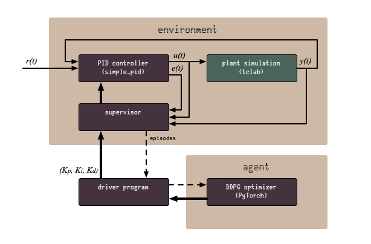
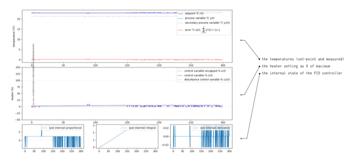
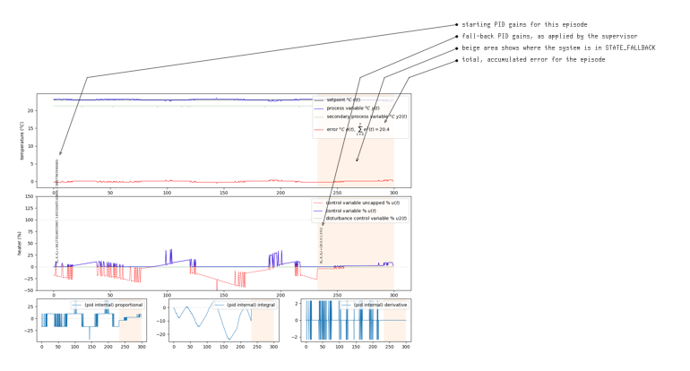

# Stability Preserving PID Auto-tuner
Industrial and marine systems use
[Proportional Integral Derivative controllers (PID)](https://en.wikipedia.org/wiki/PID_controller)
for a lot of things. PID controllers are simple to use and very effective. In
spite of that, PID controller tuning is an area that still leaves room for
improvement. In many cases, PIDs are quickly hand-tuned and then left to
operate under what is likely a suboptimal set of parameters. This makes tuning
of PID controllers ripe for automation.

There is another reason for continuous tuning. As a system ages, its behaviour
may change over time. Materials wear and components may be swapped out for
equivalent, but not identical, replacements. In an ideal world, all PID
controllers on systems would be periodically re-tuned to compensate for changes
in response of systems. If not periodically, then at least they should be
retuned whenever components are replaced. In practice this rarely happens. Even
the initial tuning is often done quickly and conservatively. A PID controller
with a fixed set of parameters is not equipped to adapt to change in the plant's
behaviour.

This project explores a safe, stability-preserving, Reinforcement Learning (RL)
based automatic PID controller tuning mechanism. The work of this project is
heavily based on
[Stability-preserving automatic tuning of PID control with reinforcement learning](https://arxiv.org/abs/2112.15187)
by Ayub I. Lakhani, Myisha A. Chowdhury and Qiugang Lu, which is released under
[CC BY 4.0](https://creativecommons.org/licenses/by/4.0/). This work will be
referred to as "the paper" throughout this project.

Note that we do not use machine learning to control the plant. Instead, we train
an agent to provide optimal PID gain values and have a classical PID controller
control the plant. In machine learning, it is more common to train an agent to
go all the way, but there are benefits for us not to take that route. PID
controllers are well understood and mathematically easy to explain. For systems
in environments where human lives are dependent on the good operation of
systems, the verifiability of the operation of that system is very important.
Pure RL control would turn the control system into a black box. By limiting the
scope of RL to PID tuning, the tuning process may be a black box, but the
resultant plant controller is well understood and explainable.

In cases where the reinforcement learning never converges or fails in some other
way, humans can still go in, and take control and hand-tune the PID controller.
This gives engineers the option to maintain automatic control under partial
systems failure.

Finally, reinforcement learning does not tire or get bored. It follows subtle
changes in plant response. Specifically in an environment where energy
conservation is important, well tuned PID controllers can help eek out the last
few drops of performance.

---
## Flawed Premise
Of course, the whole premise for the idea that I present in this project is
flawed. The reason not to tune PID controllers is in part lack of knowledge and
in part lack of a real need, finished off by the fact that developers choose
predictability over performance. Making a machine learning based auto-tuner
solves none of these. If anything, the relative novelty of machine learning for
this application will drive developers away from using it.

So this tuner either works fully automatically and invisibly in the background,
or it will never be used.

So, with that out of the way...

---
## Reading this Document
This document guides you through the process of getting from a no-frills,
traditional plant control, all the way to an stability-preserving, machine
learning, auto-tuning PID control system.

Readers are expected to have basic knowledge of what a PID controller does. You
may even have applied one in one of your programs, but that is not necessary to
follow this material. If you'd like to fork this repository for your own
purposes, working knowledge of Python is required and you should be able to read
PyTorch code.

Incidentally, if you do fork this repository, pull requests with improvements
are very much appreciated.

We start with the [design](#design), giving you an overview of what we are
working towards, although we do so in smaller steps. We the set up
[basic plant control](#running-basic-plant-control) with a simulated PID
controlled heater. We then add the
[stability-preserving supervisor](#add-stability-preserving-supervisor). There
is nothing magical or machine learning related for these first steps. Just
building the test bed for the more advanced steps.

On top of the supervised plant control we add the automated tuning process.

Finally, this project went through several iterations, most of which I kept a
logbook for. If you are interested in my personal learning path, you will find
[my logbook](documentation/iterations.md) interesting.

---
## Design
The diagram below shows the design of the whole system. We will use a plant
simulator to explore the operation of the stability-preserving PID tuner.

Shown are two clusters: the environment and the agent, in the naming convention
of the machine learning community. The environment shows the PID controller,
receiving the set-point $r(t)$ and feeding the control variable $u(t)$ into the
simulated plant. The plant's output is the process variable $y(t)$, which is fed
back into the PID controller. the PID controller uses $y(t)$ and $r(t)$ to
determine the present error value $e(t)$.

The agent cluster shows the supervisor that keeps the system stable, and the
optimiser. The fat arrows represent the flow of the $K_p$, $K_i$ and $K_d$
parameters. These parameters, also known as gains or tunings, are generated by
the machine learning based optimiser and then checked and possibly clamped by
the supervisor. The paper proposes to use the squared error of the running
controller and comparing that against a benchmark error. If the benchmark is
exceeded, the supervisor kicks in and changes the PID controller to use its
fall-back parameter set.

<p align="center" width="100%">
     
</p>

The simulated plant is shown in a green colour, while the brown components would
also be deployed to a production environment.

Where the diagrams in the paper show tight integration between the optimiser and
the environment, we keep these separate. The driver program queries the machine
learning model for PID gains and hands these to the supervisor to run episodes
with. The supervisor gives the episode results back to the driver program, who
feeds that into the machine learning model for learning. The optimiser does not
observe the plant directly. This makes experimentation much easier.

### The Agent's Action Space and Action Scaling

Most reinforcement learning algorithms have a discrete action space. In this
project, we try to learn the PID parameters and these are continuous,
effectively creating an infinite action space. There are algorithms that can
deal with continuous action spaces, and this project applies
[Deep Deterministic Policy Gradient (DDPG)](https://arxiv.org/abs/1509.02971v6),
as proposed in the paper.

Though we chose not to do so, there are ways we could have made the action space
discrete. For example, we could have used increase/decrease controls on each PID
parameter.

Before we can apply the chosen action, we have to scale it. The agent chooses
each of its three action values between 0.0 and 1.0. The PID controller uses
gain values that can range in the 100's for the proportional gain, but are
probably much lower for the integral gain and even lower for the derivative
gain. The PID controller also expects PID parameters to either all be positive
(for forward acting control) or all be negative (for reverse acting control).
All this to say that we need a scaling function that maps the chosen action
values onto the gain values. We do this by multiplying each gain value
separately, so that we can have different values for each gain.


---
## Virtual Environment and Dependencies
We tried to lock down every dependencys into a `requirements.txt` file, but not
all dependencies are trivial to install via the `pip` command. Notably,
maintenance of TCLab has stopped due to personal circumstances of the
maintainer. The latest `pip`-installable version is not compatible with the
newer Python versions. Thus, we install that package manually.

```bash
$ python3 -m venv venv
$ source venv/bin/activate
(venv) $ pip install https://github.com/jckantor/TCLab/archive/master.zip
(venv) $ pip install -r requirements.txt
```

With the virtual environment set up, you are now ready to run the code for this
project. If you don't use virtual environments a lot, don't forget to activate
it when you return to the project.

---
## Basic Plant Control
Before we worry about the complexity of supervision and automatic PID tuning, we
need an environment where we can control a plant. This script brings the control
components together into a working simulation. These just use a fixed set of PID
parameters.

For the simulated plant, we'll use
[Temperature Control Lab (TCLab)](http://www.apmonitor.com/pdc/index.php/Main/ArduinoTemperatureControl)
by [APMonitor](https://apmonitor.com). The advantage of TCLab is that it can be
used in code as simulator as well as being available as Arduino shield for real
world testing. The TCLab has two heating elements, but we only use one of them
for this project.

For the PID controller, we use
[simple_pid](https://simple-pid.readthedocs.io/en/latest/user_guide.html) by
[Martin Lundberg](https://github.com/m-lundberg). This is a neat little PID
controller library for Python. We don't use its `output_limits` property, but
implement capping $u(t)$ in code. That way we can plot the capped versus
uncapped values in the graphs during analysis. This gives a sense of how well
the capacity of the plant matches the desired control range.

Simulations with the plant control class run in episodes of length $T$, as is
being done in the paper. Working with time-limited episodes gives each run a
simple end condition. Later on, it gives us a nice granularity for training
machine learning models.

### TCLab Details
The TCLab has two heating elements and two temperature sensors, as shown in the
diagram below. The diagram also shows the variable names that we use for each
item. For normal simulations, we only use heater $U1$ and sensor $T1$.

<p align="center" width="100%">
     
</p>

Interestingly, the two heating elements do interact, as shown by the dashed line
between the arrows. You can see it when you look at the secondary process
variable in the graphs below. When we switch on (say) heater `U1`, the
temperature for the other heater rises slightly, as measured on `T2`. This is
true for the simulated as well as the physical systems. In fact, experimenting
with this interaction is part of the course materials designed for the TCLab. We
may use this at a later stage to simulate component wear.

### Time and Realtime
Since we plan to run this system on actual hardware, we run the simulations in
real, wall-clock time. This means that simulations run for a long time to get
results. Training 2000 episodes, like in the paper, will take almost a week of
wall-clock time.

See also:
[Synchronising with Real Time](https://tclab.readthedocs.io/en/latest/notebooks/03_Synchronizing_with_Real_Time.html)
for the TCLab and for `simple_pid` see
[`__call()__` API reference](https://simple-pid.readthedocs.io/en/latest/reference.html#simple_pid.pid.PID.__call__).

### Running Basic Plant Control
Here is how to run the basic plant control. For now, the set-point is just a
fixed value of $23 \celsius$.

The programming is cyclic, just like it would be on a PLC, for example. In fact,
if you own a TCLab device, you can use this loop to control that. Much as I like
matrix processing and its efficiency, the matrix programming model does not fit
the continuous control loop that is common for live systems.

If you own a TCLab device, edit the script to set `IS_HARDWARE` to `True` (it
defaults to `False`). That will make the control loop start controlling the
actual device.

```sh
(venv) $ python plant_control.py
```

The program runs continuously. You can break out of it using `^C`.

The episodes are saved under `./episodes/` as
[Apache Parquet](https://parquet.apache.org/) data frames. You can load these
easily with Panda's for further processing. To help better understand what is
the plant and the controller are doing, each episode is plotted in a few graphs.
You can find these plots under `./episodes`, as mentioned previously. here is an
example of such a graph, with a few explanatory pointers.

<p align="center" width="100%">
     
</p>

The top two graphs are pretty easy to read: they show what the termperatures and
heaters are doing. The three smaller graphs at the bottom expose the internal
state of the PID controllers, something you would normally not have access to.
To be clear: these are not the PID gains or parameter vaiues. They are the
internal values that the PID controller uses to calculate its output. The PID
gains do not change during an episode. Well, not for the basic plant control,
anyway.

---
## Add Stability Preserving Supervisor
The supervisor behaves as the paper proposes: monitor the running error and if
that exceeds a benchmark value, reconfigure the PID controller with known-good,
fall-back parameters. At the end of each episode, the PID controller is reset
with a fresh set of PID gains and the supervisor resets the running error.

An alternative might have been to have the baseline controller run alongside the
operational controller and have the supervisor switch between the two. The
problem with that is that the supervisor cannot determine $y(t)'$ for the stable
controller, because its $u(t)'$ is not passed through the plant.

More formally, the running error $RR(t)$ is compared to benchmark error
$R_{bmk}$. If $RR(t) > R_{bmk}$, the supervisor goes into fall-back state. After
each $T$ steps, the PID controller goes back to the normal state. The state
machine is shown below.

<p align="center" width="100%">
     
</p>

This is a bit confusing for three reasons: first, the _name_ suggests $RR(t)$ is
the running reward, but the actual use is that of running error. Second, we
compare a _running_ total against a _static_ benchmark. Third, in reinforcement
learning, using a reward is more common than using loss. In the implementation
we chose to use the same variable names, in spite of them being a little
confusing. Apologies if that is confusing.

### Running Supervised Plant Control
Here is how to run the supervised plant control, with the set-point of
$23 \celsius$. The episodes are saved under `./episodes/` as before.

```sh
(venv) $ python supervised_plant_control.py
```

To get a sense of how the supervisor helps, you can run a completely random
agent. This agent just generates random values as PID gains and passes them to
the supervisor to try. As you will see, in the vast majority of cases, the
supervisor will have to revert the PID to using the fall-back values instead.

```sh
(venv) $ python random_but_stable_pid_autotuner.py
```

Again, the data and graphs are saved uner `./episodes`. Below is an example of a
graph where the supervisor had to step in and revert to known-stable PID values.

<p align="center" width="100%">
     
</p>

In that plot, we can see the supervisor kick in around the $t \approx 230$ mark.
The beige area signifies that the supervisor is in `STATE_FALLBACK`. As we can
see from the plots, the heater is driven rather eratically. Once the fall-back
parameters have been applied, the system settles down again.

In this specific example, we can see that $K_p$ is too large, causing the heater
to be driven too hard. $K_i$ is working harder and harder to compensate, until
the supervisor decides the accumulated error is too great and clamps down.

We now have a stable test platform to experiment on. We can experiment with PID
parameters, without having to worry so much about the system becoming unstable.
The supervisor works nicely and the graphs give insight in what is going on
inside the controller. From here, we should start actually tuning.

---
## Auto-tuner
With the supervisor ready to take over in case the control loop becomes unstable,
we turn out attention to the auto tuning. As in the paper, we will use
[Deep Deterministic Policy Gradients (DDPG)](https://www.youtube.com/watch?v=6Yd5WnYls_Y),
adding a simple priming system to make sure the agent starts with a helpful set
of example data in its replay buffer.

The code is largely copied from our own 
[PyTorch DDPG Tutorial Implementation](https://github.com/kjkoster/ddpg-continuous-tutorial),
which in turn is a mostly-copy of
[Reinforcement Learning in Continuous Action Spaces | DDPG Tutorial (PyTorch)](https://www.youtube.com/watch?v=6Yd5WnYls_Y)
by
[Machine Learning with Phil](https://www.youtube.com/@MachineLearningwithPhil).

[DDPG and TD3 (RLVS 2021 version)](https://www.youtube.com/watch?v=0D6a0a1HTtc) by [Olivier Sigaud](https://www.youtube.com/@OlivierSigaud)

You can run the agent as follows. The agent primes the replay buffer with random
and with fall-back-related PID gain values. This will take almost two days (some
41 hours) and _after that_ DDPG needs time to learn. Useful results should take
a week or so of time (sorry).

```sh
(venv) $ python autotuning_supervised_plant_control.py
```

Once running, you can plot the progression over the episodes using the plotting
script.

```sh
(venv) $ python python plot_learning.py episodes/*.parquet
```

You can then see the progress of your agent in the generated files
`learning.png` and learning3d.png`.

